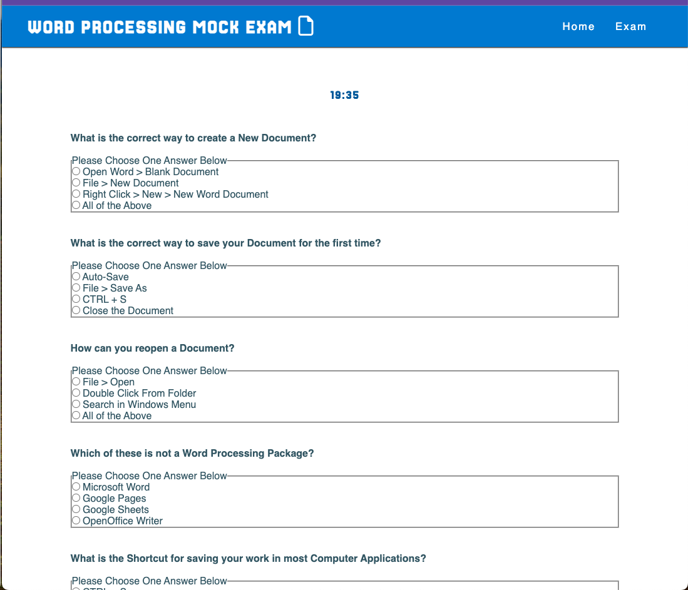

## Word Processing Online Exam - Proof of Concept

This Project is a Proof of Concept for a Mock Test generator for the QQI Level 4 Course - Word Processing 4N1123. The aim of the site is to provide Students with a way to test their knowledge of some of the base concepts of the course without waiting for set time to do so in class. 

The site as it is published now serves as an easy way for students to generate a short Mock Exam based on past exam questions and time themselves to see how their knowledge is improving over time. It is planned that future iterations of the page will allow users to ask for specific feedback on their exams and eventually allow for the upload of files in relation to the practical portion of the exam.

## Features

* Navigation Bar
    * The Nav Bar provides a clear and striking heading to the page. It also allows for fast navigation between pages.

* Home Page
    * The Home Page provides simple instructions on how to take the mock exam. The aim of this page is to keep it clear and concise while also providing all necessary information for users.

* Exam Page
    * This is the primary page of the site. It consists of 10 questions chosen from a pool of 15 total MCQs.
    * There is a timer at the top of the page to ensure that Students are practicing in a more realistic time frame

## Features to be Implemented

* Form Submissions
    * The ability for Learners to submit a copy of their responses to their teacher to allow for more in-depth marking and corrections/ instructions is planned for future releases.

## Testing

* A majority of the testing for this website was conducted using the Responsive Screen Size tool within Google Chrome’s dev mode. This allowed me to ensure that the design elements all worked across different simulated screen sizes. This also allowed for stress testing of the site by rapidly changing the size of the screen.
* The site was deployed via GitHub Pages to ensure that there were no issues that occurred between the initial development stage and the full launch of the page. Some issues were encountered during this phase and were thus resolved.
* The site was tested accross a number of devices once deployed. These devices include and iPhone 12 Pro Max, a MacBook Pro and a Samsung Galaxy Phone.

## Validator Testing

* HTML
    * No major errors were found when testing through the [W3C validator](https://validator.w3.org/nu/?doc=https%3A%2F%2Fjammie506.github.io%2FJamieMcC-PP2%2Findex.html)
    * One warning that remains on the page relates to the use of tags in the Exam Questions as all questions are left hidden by default: "The value of the for attribute of the label element must be the ID of a non-hidden form control."
* CSS
    * No errors were found when testing through the [Jigsaw validator](https://jigsaw.w3.org/css-validator/validator?uri=https%3A%2F%2Fvalidator.w3.org%2Fnu%2F%3Fdoc%3Dhttps%253A%252F%252Fcode-institute-org.github.io%252Flove-running-2.0%252Findex.html&profile=css3svg&usermedium=all&warning=1&vextwarning=&lang=en#css)

## Unfixed Bugs

* No unresolved bugs were found at this point during testing

## Deployment 

* The site was deployed to GitHub pages. The steps to deploy are as follows: 
    * In the GitHub repository, navigate to the Settings tab
    * From the source section drop-down menu, select the Master Branch
    * Once the master branch has been selected, the page will be automatically refreshed with a detailed ribbon display to indicate the successful deployment.

The live link can be found here - https://jammie506.github.io/JamieMcC-PP1/

## Credits

* The idea from the page comes from the QQI Level 4 Word Processing Course. All of the questions have come from an exam that I have completed with my students in class.
* Some additional information on HTML, CSS and JavaScript syntax was found using Web3 School website (https://www.w3schools.com/)
* Some additional information on HTML, CSS and JavaScript syntax was found using MDN Web Docs website (https://developer.mozilla.org/en-US/)

## Media

* No additional media has been added to the page at this time
